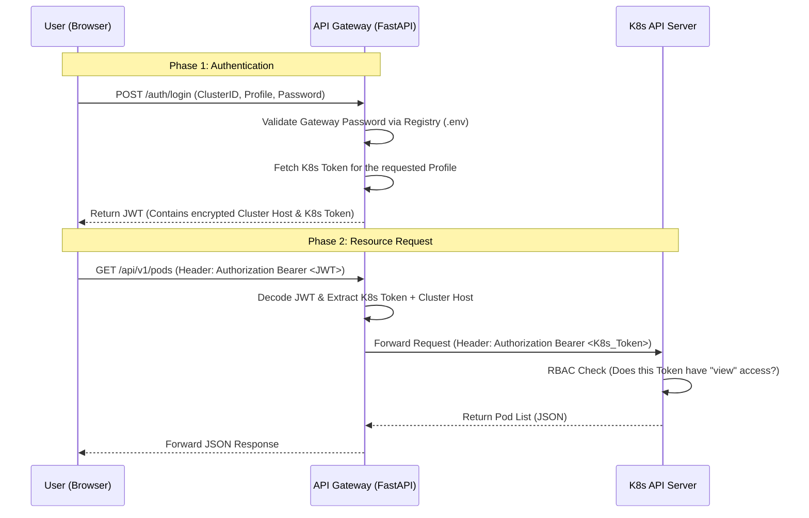

# K8s Cloud Gateway

## 1. Introduction
The **K8s Cloud Gateway** is a stateless, multi-cluster management platform designed to provide granular, profile-based access to Kubernetes resources. It acts as an intelligent proxy between end-users and multiple Kubernetes clusters, abstracting the complexity of direct `kubectl` interactions while enforcing strict security policies.

Unlike traditional dashboards, this gateway focuses on **Stateless Security**: it does not store persistent session data. Instead, it leverages **JWT (JSON Web Tokens)** to encapsulate cluster credentials, ensuring that each request is self-contained and cryptographically verified.

## 2. Core Objectives
*   **Multi-Cluster Orchestration**: Manage multiple independent Kubernetes clusters through a single unified API entry point.
*   **Stateless Authentication**: Implement a Zero-Trust approach where cluster credentials (Service Account Tokens) never reside on the client-side in plain text.
*   **Profile-Based Granularity**: Define specific access profiles (e.g., `admin`, `messaging-mgr`, `dev`) that map to native K8s RBAC (Role-Based Access Control).
*   **Resource Lifecycle Management**: Provide a lightweight interface for monitoring Pods, scaling Deployments, and performing rollout restarts without requiring local K8s toolchains.
*   **Digital Twin Support**: Facilitate the deployment of complex workloads via YAML manifest uploads directly through the web console.

## 3. High-Level Architecture
The project follows a decoupled **Producer-Consumer** architecture split into three main layers:

### A. The Frontend (Client Layer)
*   **Technology**: Vanilla HTML5, CSS3 (Enterprise Dark Theme), and Modern JavaScript (Fetch API).
*   **Role**: Handles user interaction and session persistence via `localStorage`. It communicates with the Gateway using Bearer Token authentication.

### B. The API Gateway (Orchestration Layer)
*   **Technology**: FastAPI (Python 3.11), PyJWT, Kubernetes Python Client.
*   **Role**: 
    1.  **Authentication**: Validates Gateway passwords and exchanges them for a JWT containing encrypted cluster metadata.
    2.  **Request Transformation**: Intercepts incoming requests, decodes the JWT to retrieve the target cluster's Host and Token, and forwards the command to the K8s API.
    3.  **Abstraction**: Converts complex K8s API responses into simplified JSON structures for the UI.

### C. The Kubernetes Layer (Infrastructure Layer)
*   **Technology**: K8s Nodes (e.g., Ubuntu/VirtualBox), Service Accounts, RBAC.
*   **Role**: The final destination of the commands. It enforces the actual permissions dictated by the Service Account Token provided by the Gateway.

## 4. Technical Data Flow & Security Workflow

Instead of storing Kubernetes Service Account tokens in a database or local session, the gateway "wraps" them into a short-lived, encrypted JWT.

### Sequence Diagram
The following diagram illustrates the interaction between the User (Browser), the Gateway API, and the Kubernetes Cluster during a standard resource request.



### Key Workflow Steps

1.  **Identity Exchange**: During login, the user provides a "Gateway Password". The Gateway verifies this against the `.env` configuration. If valid, it retrieves the corresponding **Kubernetes Service Account Token**.
2.  **JWT Encapsulation**: The Gateway generates a JWT. Crucially, the **K8s Token is stored inside the JWT payload**. This makes the Gateway stateless: it doesn't need to "remember" who you are; the token you carry holds all the information needed to talk to K8s.
3.  **Dynamic Client Injection**: For every request (e.g., listing pods), a `K8sClientFactory` instantiates a temporary Kubernetes client using the host and token extracted from the JWT.
4.  **Backend Pass-through**: The Gateway never modifies the permissions. It simply acts as a secure tunnel. If the K8s Token has limited permissions (e.g., only `view` on a specific namespace), Kubernetes itself will reject unauthorized actions, and the Gateway will forward that `403 Forbidden` error to the UI.

## 5. Configuration & Dynamic Scaling

The Gateway is designed for **Horizontal Configuration Scaling**. It uses a naming convention in environment variables to automatically discover and register new clusters and access profiles at startup.

### The Dynamic Registry Logic
The `ClusterRegistry` module scans the environment variables for the `CLUSTER_{ID}_` prefix. This allows the system to:
1.  **Identify the Cluster**: Through the `HOST` variable.
2.  **Map Access Profiles**: Each cluster can have infinite profiles (e.g., `admin`, `dev`, `monitoring`).
3.  **Encapsulate Security**: Each profile is mapped to its own Gateway Password and K8s Service Account Token.

### Setup Example (`.env`)
To add a new cluster named `PRODUCTION`, you simply append these lines to your `.env` file:

```bash
# --- NEW CLUSTER: PRODUCTION ---
CLUSTER_PRODUCTION_HOST=https://10.0.0.50:6443

# Define Cluster Service Account to be mapped
CLUSTER_PRODUCTION_PROFILES=admin,dev

# Profile: Admin (Full access)
CLUSTER_PRODUCTION_TOKEN_ADMIN=eyJhbGci...
CLUSTER_PRODUCTION_PASS_ADMIN=prod_secure_pass_2026

# Profile: Developer (Namespace restricted)
CLUSTER_PRODUCTION_TOKEN_DEV=eyJhbGci...
CLUSTER_PRODUCTION_PASS_DEV=dev_access_123
```

### SSL/TLS Configuration (CA Certificates)
For production-grade security, the Gateway must verify the identity of the K8s API server. This is handled via a **CA Certificate Volume Mount**:

*   **Host Path**: `./backend/certs/ca.crt`
*   **Container Path**: `/app/certs/ca.crt` (configured via `K8S_CA_CERT_PATH`)

This ensures that even if the Gateway is stateless, the communication channel with the cluster remains encrypted and verified against a trusted Authority.

## 6. Deployment with Docker Compose

The entire stack is containerized for "One-Command Deployment". It orchestrates two main services:

1.  **`backend`**: The FastAPI application serving the API.
2.  **`frontend`**: An Nginx-alpine instance serving the static HTML/JS/CSS dashboard.

### Quick Start
```bash
# 1. Clone the repository
git clone <your-repo-link>

# 2. Configure your .env file with your K8s Tokens
cp .env.example .env

# 3. Spin up the infrastructure
docker-compose up --build
```

The console will be available at `http://localhost`, while the API documentation (Swagger) can be accessed at `http://localhost:8000/docs`.

---

