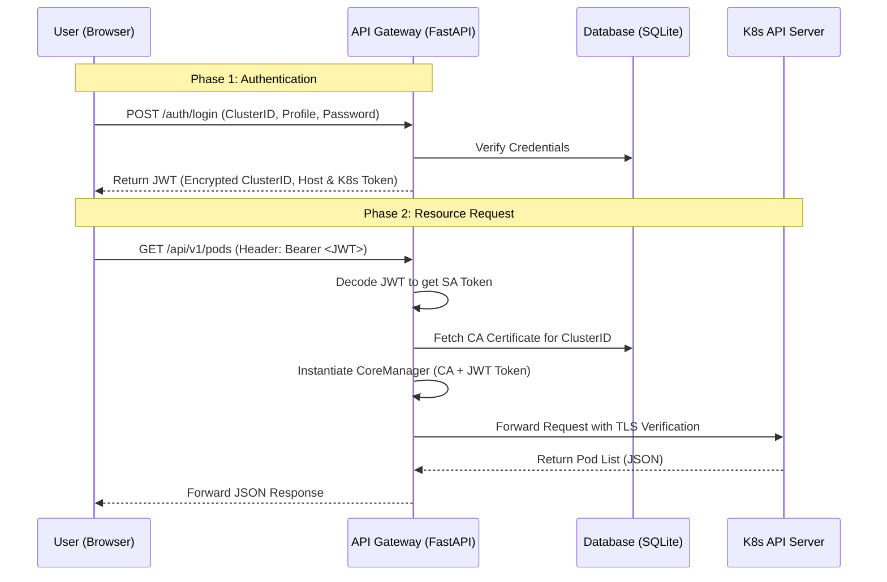

# K8s Cloud Gateway

## 1. Introduction
The **K8s Cloud Gateway** is a stateless, multi-cluster management platform designed to provide granular, profile-based access to Kubernetes resources. It acts as an intelligent proxy between end-users and multiple Kubernetes clusters, abstracting the complexity of direct `kubectl` interactions while enforcing strict security policies.

Unlike traditional dashboards, this gateway focuses on **Stateless Security**: the server does not store session data. Instead, it leverages **JWT (JSON Web Tokens)** to encapsulate cluster credentials, ensuring that each request is self-contained and cryptographically verified.

## 2. Core Objectives
*   **Multi-Cluster Orchestration**: Manage multiple independent Kubernetes clusters through a single unified API entry point.
*   **Stateless Authentication**: Implement a Zero-Trust approach where cluster credentials (Service Account Tokens) never reside on the client-side in plain text.
*   **Profile-Based Granularity**: Define specific access profiles (e.g., `admin`, `dev`) that map to native K8s RBAC (Role-Based Access Control).
*   **Resource Lifecycle Management**: Provide a lightweight interface for monitoring Pods, scaling Deployments, and performing rollout restarts.
*   **Database-Driven Configuration**: Dynamically manage clusters and access profiles via a persistent database instead of static environment variables.

## 3. High-Level Architecture
The project follows a decoupled architecture split into three main layers:

### A. The Frontend (Client Layer)
*   **Technology**: Vanilla HTML5, CSS3, and Modern JavaScript (Fetch API).
*   **Role**: Handles user interaction and session persistence via `localStorage`. It communicates with the Gateway using Bearer Token authentication.

### B. The API Gateway (Orchestration Layer)
*   **Technology**: FastAPI (Python 3.11), PyJWT, Kubernetes Python Client, SQLAlchemy.
*   **Role**: 
    1.  **Authentication**: Validates Gateway passwords against the DB and exchanges them for a JWT containing encrypted cluster metadata (Host & K8s Token).
    2.  **Security Dependency Injection**: A core `get_core_manager` dependency intercepts requests, decodes the JWT, and fetches the corresponding **CA Certificate** from the database to instantiate a secure `CoreManager`.
    3.  **Abstraction**: Converts complex K8s API responses into simplified JSON structures for the UI.

### C. The Kubernetes Layer (Infrastructure Layer)
*   **Role**: The final destination of the commands. It enforces the actual permissions dictated by the Service Account Token provided by the Gateway.

## 4. Technical Data Flow & Security Workflow

The gateway avoids persistent server sessions by "wrapping" the Kubernetes Service Account token into a short-lived, encrypted JWT.

### Sequence Diagram


### Key Workflow Steps

1.  **Identity Exchange**: During login, the user provides the "Cluster ID", a "Profile" (corresponding to a Service Account) and a "Gateway Password". The Gateway verifies this against the database. If valid, it retrieves the **Kubernetes Service Account Token**.
2.  **JWT Encapsulation**: The Gateway generates a JWT containing the **K8s Token** and **Cluster Host**. The JWT does *not* contain the CA Certificate to keep the token size manageable and secure.
3.  **Dependency-Based Client Injection**: For every resource request, a FastAPI dependency decodes the JWT. It uses the `cluster_id` from the payload to query the database for the specific **CA Certificate**.
4.  **Backend Pass-through**: The `CoreManager` uses the database-stored CA to verify the K8s API server's identity. If the K8s Token has limited permissions (e.g., only `view` on a specific namespace), Kubernetes will enforce RBAC and the Gateway will forward the result.

## 5. Persistence & Certificate Management

The Gateway has transitioned from static environment variables to a **Persistent Database Registry** for improved scalability and security.

### Persistent Registry Logic
The system uses a relational database to manage:
1.  **Clusters**: Stores the Cluster ID, the API Host URL, and the **CA Certificate content** (uploaded via API).
2.  **Profiles**: Maps specific access profiles to their respective cluster, passwords and K8s Service Account Tokens.

### SSL/TLS Configuration
Security is handled dynamically:
*   **No Volume Mounts**: CA Certificates are no longer stored as files on the host but are stored directly in the database as strings.
*   **On-the-Fly Verification**: When a request is made, the certificate is pulled from the DB and used by the Python Kubernetes client to establish a trusted TLS connection.

---

## 6. API Capabilities & Dashboard Integration

The Gateway exposes a comprehensive set of RESTful endpoints designed to map 1:1 with the Dashboard's visual controls. Each request is authenticated and routed to the correct cluster context via the `CoreManager` dependency.

### A. Resource Orchestration (Read/Write)
The dashboard leverages these endpoints to provide a real-time view of the cluster state:

*   **Workload Management**: Full CRUD on **Pods** and **Deployments** (including scaling, logs retrieval, and rollout restarts).
*   **Networking**: Monitoring and management of **Services**.
*   **Configuration**: Visibility into **ConfigMaps**, **Secrets**, and cluster **Events**.
*   **Namespaces**: Dynamic creation and listing of isolated environments.
*   **Infrastructure**: Real-time technical details of the cluster **Nodes**.

### B. The "Universal Apply" (Digital Twin Engine)
One of the core features of the gateway is the `POST /apply` endpoint. This allows users to bypass individual forms and deploy complex infrastructures in one go.
*   **How it works**: Upload any standard `.yaml` or `.yml` file. 
*   **Result**: The gateway parses the manifest and applies all contained resources (Deployments, Services, RBAC) to the specified namespace.

### C. Security & RBAC Monitoring
To ensure compliance, the gateway provides specific endpoints to audit the security posture of each namespace:
*   **Service Accounts**: List and delete identities.
*   **Roles & RoleBindings**: Audit who has access to what, directly from the UI.

### Endpoint Overview Table

| Category | Method | Path | Dashboard Action |
| :--- | :--- | :--- | :--- |
| **Apply** | `POST` | `/namespaces/{ns}/apply` | **Upload YAML Manifest** |
| **Pods** | `GET` | `/namespaces/{ns}/pods` | View Pod List |
| **Deploy** | `PATCH` | `/namespaces/{ns}/deployments/{n}/scale` | **Scale Replicas** |
| **Deploy** | `POST` | `/namespaces/{ns}/deployments/{n}/restart` | **Rollout Restart** |
| **Logs** | `GET` | `/namespaces/{ns}/pods/{n}/logs` | View Live Logs |
| **Nodes** | `GET` | `/cluster/nodes` | Cluster Health Status |
| **RBAC** | `GET` | `/namespaces/{ns}/rolebindings` | Access Audit |


While the Dashboard provides a user-friendly interface, the full interactive API documentation is always available for developers at:
`http://localhost:8000/docs`

---


## 7. Deployment with Docker Compose

The entire stack is containerized for "One-Command Deployment":

1.  **`backend`**: The FastAPI application serving the API and managing the SQLite database.
2.  **`frontend`**: An Nginx instance serving the static dashboard.

### Quick Start
```bash
# 1. Clone the repository
git clone https://github.com/AndreaProzzo21/k8s-cloud-gateway.git

# 2. Spin up the infrastructure (Database initializes automatically)
docker-compose up --build
```

### Next Steps (Roadmap)
*   **HTTP-Only Cookies**: Move from `localStorage` to `HttpOnly` cookies to store JWTs, mitigating XSS risks.
*   **Encrypted Persistence**: Implement AES-256 encryption for the `k8s_token` and `gateway_password` columns within the database.

---