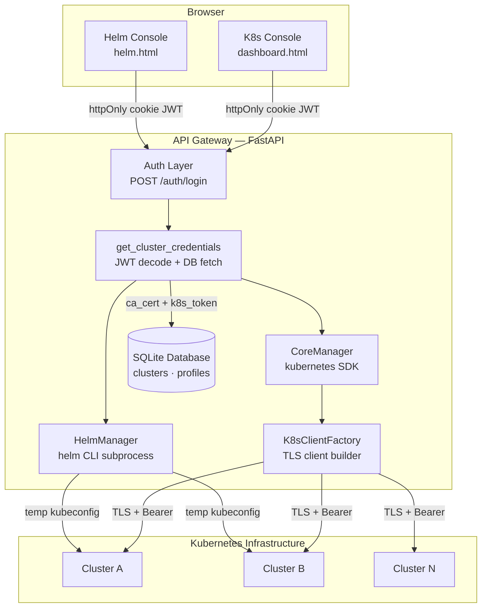
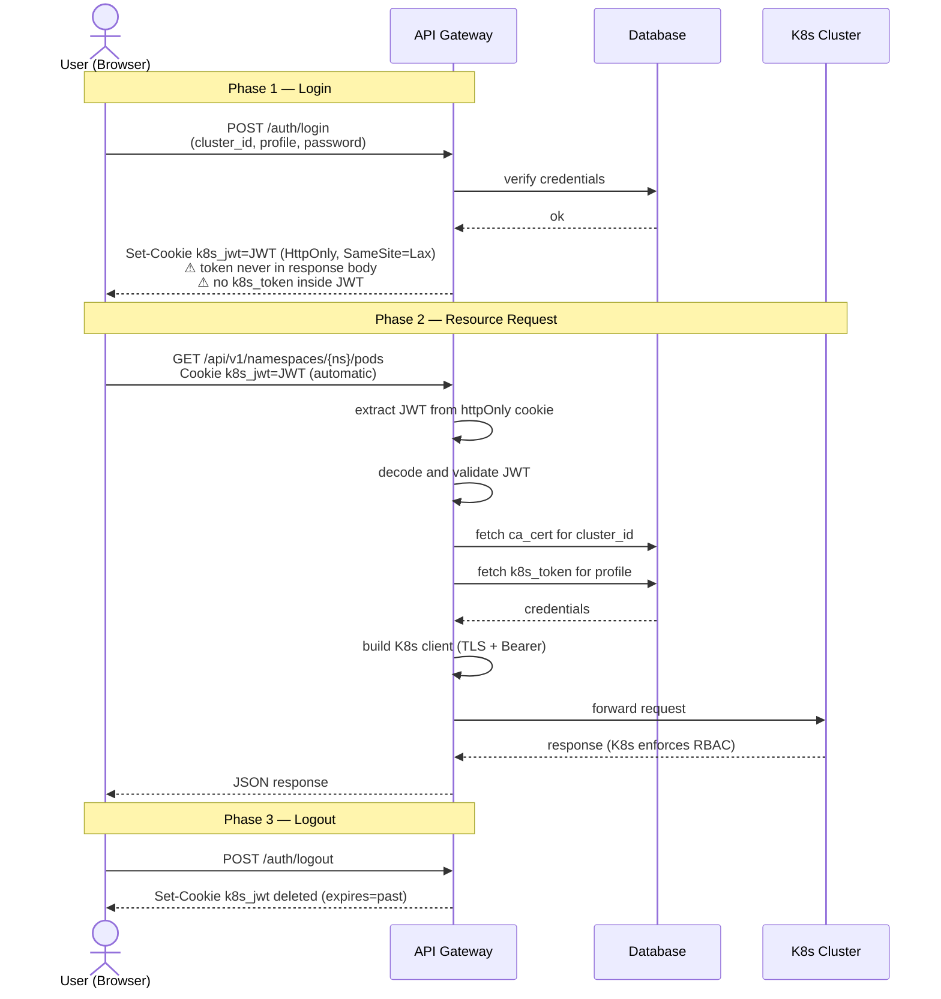
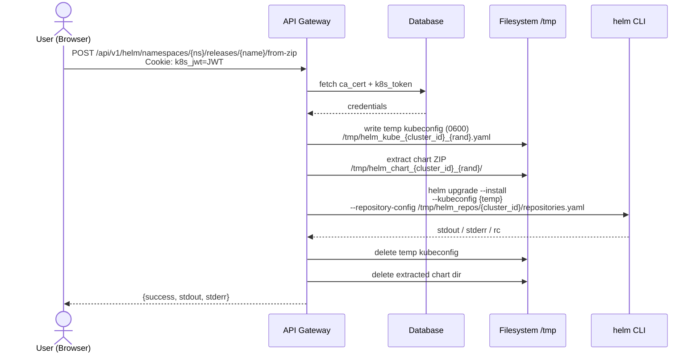

# Integrated Framework for Multi-Cluster Kubernetes Governance: Secure Helm Distribution and RBAC-driven Orchestration.

> A zero-knowledge, multi-tenant Kubernetes management platform. Credentials never leave the server — users get access, not keys.

[](https://python.org)
[](https://fastapi.tiangolo.com)
[](https://docker.com)
[](https://helm.sh)

---

## What is this platform?

This gateway is a self-hosted web platform that acts as an authenticated proxy between your users and your Kubernetes clusters. Instead of distributing `kubeconfig` files or Service Account tokens, the platform issues short-lived JWTs that contain **no Kubernetes credentials**. Every real credential — SA token, CA certificate — lives exclusively in the server-side database and is injected per-request, invisible to the client.

The result is a team-friendly control plane where access is managed through profiles, revocation is instant, and the blast radius of a stolen JWT is limited to what the gateway exposes — not direct cluster access.

**Two integrated consoles:**

- **K8s Console** — real-time visibility and operations: namespaces, pods, deployments, services, ingresses, RBAC, storage, events.
- **Helm Console** — application lifecycle management: install charts from repositories or ZIP uploads, inspect history, rollback, lint before deploying.

---

## Core Design Principles

**Zero-knowledge client side.** The browser JWT contains only `cluster_id` and `profile`. The Kubernetes SA token and CA certificate are fetched server-side from the database on every authenticated request and discarded after use.

**Stateless architecture.** The gateway holds no session state. Each request is fully self-contained: verify JWT → fetch credentials from DB → build scoped K8s client → forward request → discard client.

**K8s enforces authorization.** The gateway delegates all resource-level access control to Kubernetes RBAC. A restricted Service Account will receive `403` from the cluster; the gateway propagates it to the frontend. No shadow permission system.

**Profile-based multi-tenancy.** Each cluster supports multiple profiles (e.g. `admin`, `dev`, `ci`), each mapping to a different Service Account. A user authenticates against a profile, not against the cluster directly.

**Per-cluster Helm isolation.** Each cluster maintains its own Helm repository configuration and cache, invisible to users of other clusters.

---

## High-Level Architecture


```mermaid
graph TB
    subgraph Browser["Browser"]
        K8sUI["K8s Console<br/>dashboard.html"]
        HelmUI["Helm Console<br/>helm.html"]
    end

    subgraph Gateway["API Gateway — FastAPI"]
        Auth["Auth Layer<br/>POST /auth/login"]
        SharedDep["get_cluster_credentials<br/>JWT decode + DB fetch"]
        CoreMgr["CoreManager<br/>kubernetes SDK"]
        HelmMgr["HelmManager<br/>helm CLI subprocess"]
        K8sFactory["K8sClientFactory<br/>TLS client builder"]
        DB[("SQLite Database<br/>clusters · profiles")]
    end

    subgraph Clusters["Kubernetes Infrastructure"]
        C1["Cluster A"]
        C2["Cluster B"]
        CN["Cluster N"]
    end

    K8sUI -->|httpOnly cookie JWT| Auth
    HelmUI -->|httpOnly cookie JWT| Auth
    Auth --> SharedDep
    SharedDep -->|ca_cert + k8s_token| DB
    SharedDep --> CoreMgr
    SharedDep --> HelmMgr
    CoreMgr --> K8sFactory
    K8sFactory -->|TLS + Bearer| C1
    K8sFactory -->|TLS + Bearer| C2
    K8sFactory -->|TLS + Bearer| CN
    HelmMgr -->|temp kubeconfig| C1
    HelmMgr -->|temp kubeconfig| C2
```

---

## Authentication Flow


```mermaid
sequenceDiagram
    actor User as User (Browser)
    participant GW as API Gateway
    participant DB as Database
    participant K8s as K8s Cluster

    Note over User,GW: Phase 1 — Login
    User->>GW: POST /auth/login<br/>(cluster_id, profile, password)
    GW->>DB: verify credentials
    DB-->>GW: ok
    GW-->>User: Set-Cookie k8s_jwt=JWT (HttpOnly, SameSite=Lax)<br/>⚠ token never in response body<br/>⚠ no k8s_token inside JWT

    Note over User,K8s: Phase 2 — Resource Request
    User->>GW: GET /api/v1/namespaces/{ns}/pods<br/>Cookie k8s_jwt=JWT (automatic)
    GW->>GW: extract JWT from httpOnly cookie
    GW->>GW: decode and validate JWT
    GW->>DB: fetch ca_cert for cluster_id
    GW->>DB: fetch k8s_token for profile
    DB-->>GW: credentials
    GW->>GW: build K8s client (TLS + Bearer)
    GW->>K8s: forward request
    K8s-->>GW: response (K8s enforces RBAC)
    GW-->>User: JSON response

    Note over User,GW: Phase 3 — Logout
    User->>GW: POST /auth/logout
    GW-->>User: Set-Cookie k8s_jwt deleted (expires=past)
```

**JWT payload contains:** `cluster_id`, `cluster_host`, `profile`, `jti`, `exp`
**JWT payload never contains:** `k8s_token`, `ca_cert`, `password`
**JWT transport:** `HttpOnly` cookie — never accessible from JavaScript, never stored in `localStorage`

---

## Helm Request Flow


```mermaid
sequenceDiagram
    actor User as User (Browser)
    participant GW as API Gateway
    participant DB as Database
    participant FS as Filesystem /tmp
    participant Helm as helm CLI

    User->>GW: POST /api/v1/helm/namespaces/{ns}/releases/{name}/from-zip<br/>Cookie: k8s_jwt=JWT
    GW->>DB: fetch ca_cert + k8s_token
    DB-->>GW: credentials
    GW->>FS: write temp kubeconfig (0600)<br/>/tmp/helm_kube_{cluster_id}_{rand}.yaml
    GW->>FS: extract chart ZIP<br/>/tmp/helm_chart_{cluster_id}_{rand}/
    GW->>Helm: helm upgrade --install<br/>--kubeconfig {temp}<br/>--repository-config /tmp/helm_repos/{cluster_id}/repositories.yaml
    Helm-->>GW: stdout / stderr / rc
    GW->>FS: delete temp kubeconfig
    GW->>FS: delete extracted chart dir
    GW-->>User: {success, stdout, stderr}
```

---

## Admin API

Cluster and profile management is protected by a master key sent in the `X-Admin-Key` HTTP header. This API is intended for platform administrators only and is not exposed through the frontend.

```
Base path: /api/v1/admin
Header:    X-Admin-Key: <ADMIN_MASTER_KEY>
```

### Clusters

| Method | Path | Description |
|---|---|---|
| `GET` | `/clusters` | List all registered clusters |
| `POST` | `/clusters` | Register a new cluster (`multipart/form-data`: `id`, `name`, `host`, `ca_file`) |
| `PATCH` | `/clusters/{cluster_id}` | Update cluster name, host, or CA certificate |
| `DELETE` | `/clusters/{cluster_id}` | Remove cluster and all associated profiles |

### Profiles

| Method | Path | Description |
|---|---|---|
| `GET` | `/profiles` | List all profiles (token preview only, never full token) |
| `POST` | `/profiles` | Create a profile (`JSON`: `cluster_id`, `name`, `gateway_password`, `k8s_token`) |
| `PATCH` | `/profiles/{profile_id}` | Update password or SA token |
| `DELETE` | `/profiles/{profile_id}` | Remove a profile |

**Register a cluster (example):**

```bash
curl -X POST http://localhost/api/v1/admin/clusters \
  -H "X-Admin-Key: your-admin-key" \
  -F "id=MY-CLUSTER" \
  -F "name=Production K3s" \
  -F "host=https://10.0.0.1:6443" \
  -F "ca_file=@/path/to/ca.crt"
```

**Register a profile (example):**

```bash
curl -X POST http://localhost/api/v1/admin/profiles \
  -H "X-Admin-Key: your-admin-key" \
  -H "Content-Type: application/json" \
  -d '{
    "cluster_id": "MY-CLUSTER",
    "name": "dev",
    "gateway_password": "dev-password",
    "k8s_token": "eyJhbGci..."
  }'
```

---

## Deployment (Docker)

### Prerequisites

* **Docker and Docker Compose** installed on your host machine.
* One or more Kubernetes clusters with dedicated Service Accounts and their tokens.
* The CA certificate of each cluster (`ca.crt` in PEM format).
* Network connectivity from the gateway host to each cluster's API server (typically port `6443`).

### 🚀 Quick Start (Automated Installer)

The fastest and most reliable way to get the Gateway running is using the interactive bootstrap script. It downloads the necessary files, guides you through the security configuration, and starts the platform automatically.

#### Run the official installation script

```bash

curl -sSL https://raw.githubusercontent.com/AndreaProzzo21/k8s-cloud-gateway/main/install.sh | bash

```

*The script will prompt you to set a secure `ADMIN_MASTER_KEY` and will optionally auto-generate the encryption keys for you.*

**Next Steps:**

1. Open `http://localhost/admin.html` and log in with your new Admin Master Key.
2. Register your first cluster and link an admin profile.
3. Access the main dashboard at `http://localhost`.

### 🛠️ Manual Installation

If you prefer to review the files beforehand or deploy without the script, you can use the pre-configured Docker Compose setup.

1. Download the `deploy/docker-compose-deploy` folder from this repository (or grab the source code `.zip` from the **Releases** page).
2. Navigate into the folder and prepare your environment variables:
```bash
cp .env.example .env

```


3. Edit the `.env` file to configure your environment:
* **`ADMIN_MASTER_KEY`**: Set a strong password (mandatory).
* **Networking**: Adjust `GATEWAY_PORT` if needed, and set `CORS_EXTRA_ORIGINS` if you plan to access the API from different external domains.
* **Security Keys**: If you leave `ENCRYPTION_KEY` and `JWT_SECRET_KEY` blank, the system will intelligently auto-generate them on the first boot to ensure maximum security.


4. Pull the official images and start the stack:
```bash
docker compose up -d

```


---

### Environment Variables

```dotenv
# Port through which the FastAPI backend is exposed (default: 8000, internal only)
GATEWAY_PORT=8000

# JWT signing key — use a long random string, keep it secret
JWT_SECRET_KEY=
# Generate with: python -c "import secrets; print(secrets.token_hex(32))"

# JWT signing algorithm and expiry in hours
JWT_SECRET_ALGORITHM=HS256
JWT_EXPIRE_HOURS=1

# Master key for the admin API — protect this carefully
ADMIN_MASTER_KEY=
# Generate with: python -c "import secrets; print(secrets.token_hex(32))"

# SQLite database path (relative to /app inside the container)
DATABASE_URL=data/gateway.db

# Fernet encryption key for sensitive DB fields (k8s_token, gateway_password, ca_cert)
ENCRYPTION_KEY=
# Generate with: python -c "from cryptography.fernet import Fernet; print(Fernet.generate_key().decode())"

# Additional allowed CORS origins, comma-separated (optional)
# Example: CORS_EXTRA_ORIGINS=https://k8s-gateway.example.com,http://192.168.1.10:30090
CORS_EXTRA_ORIGINS=
```

---

## Security Notes

| Topic | Current state |
|---|---|
| JWT transport | `HttpOnly` cookie — inaccessible to JavaScript, never in `localStorage` |
| XSS token theft | Mitigated — JS cannot read or exfiltrate the session cookie |
| CSRF | Mitigated by `SameSite=Lax` — cross-site requests do not carry the cookie |
| DB credentials at rest | Fernet-encrypted (`k8s_token`, `gateway_password`, `ca_cert`) |
| Authorization | Delegated to Kubernetes RBAC — no shadow permission system |
| Backend port exposure | Internal Docker/K8s network only — not reachable from host |
| Helm kubeconfig | Temp file `0600`, deleted immediately after each request |
| CA certificate | Stored encrypted in DB, written to `/tmp` per-request, never persisted |
| Admin API | Protected by `X-Admin-Key` header — consider IP allowlist in production |
| Swagger / OpenAPI | Disabled at application level — documentation on GitHub Pages |
| Secrets management | Environment variables / Kubernetes Secret — consider Vault for production |

---

### API Documentation

The interactive Swagger UI is disabled in production to avoid exposing the API schema.
Full documentation, architecture details, and API reference are available on the developer portal:

**[andreaprozzo21.github.io/k8s-cloud-gateway](https://andreaprozzo21.github.io/k8s-cloud-gateway/)**

---

## Roadmap

- [ ] Namespace allowlist per profile (enforced server-side before reaching K8s)
- [ ] WebSocket streaming for real-time pod logs
- [ ] Improve clusters background observation
- [ ] OCI registry support for Helm chart distribution
- [ ] Helm dependency resolution (`helm dependency update`) before ZIP deploy
- [ ] Vault integration for secret management
- [x] `HttpOnly` cookie-based JWT storage — XSS cannot exfiltrate the session token
- [x] Swagger UI disabled — API schema not exposed in production
- [x] Fernet encryption for sensitive database columns
- [x] Nginx reverse proxy — backend port no longer exposed to host
- [x] Fleet observer with compliance audit engine